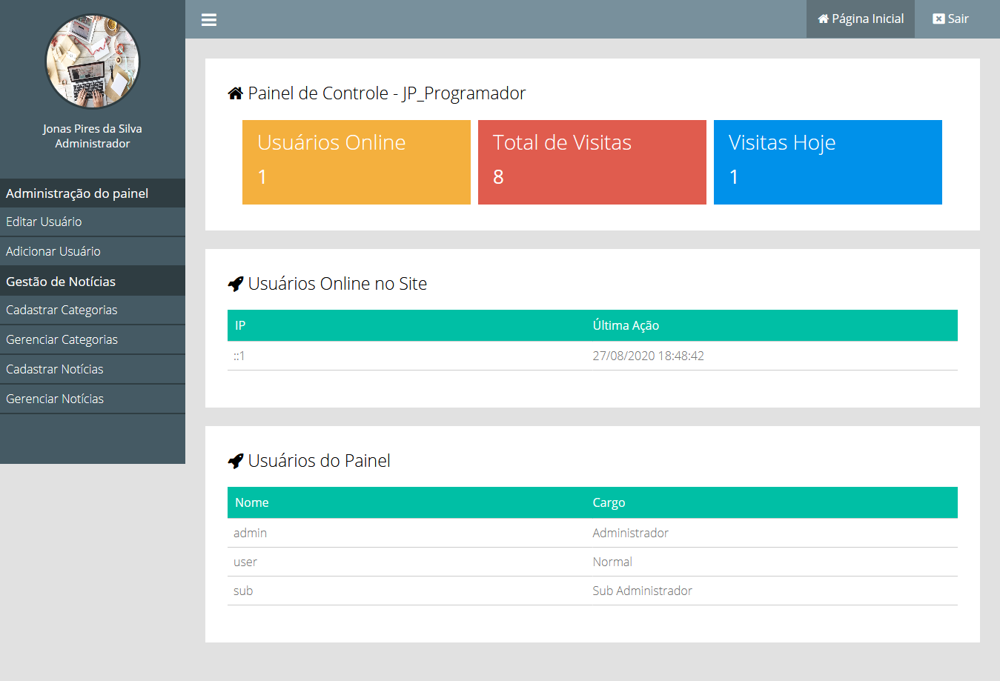

# Portal de Notícias
> Um Site de notícias com painel de controle!

Portal de notícias com Sistema de categorias,banco de dados, e painel de controle fácil de usar.
O Painel conta com um contador de usuários com IP do usuário, e um sistema de permissão para o painel 
podendo ser usuários sub-administradores, normal, e 1 administrador.

## Instalação

### Primeiramente importe o banco de dados que esta no diretório principal.

### Depois abra o arquivo config.php e altere essas constantes a seguir:

>Aqui você vai colocar o link do seu diretório principal

	define('INCLUDE_PATH','diretório_principal'); 
  
>Aqui você defini as constantes para o banco de dados, se você usa um 
servidor local como xampp você só vai ter que alterar o `DATABASE` e 
colocar nome que você deu ao seu banco de dados
 
    define('HOST','localhost');
    define('USER','root');
    define('PASSWORD','');
    define('DATABASE','nome_do_database');

### Agora você pode abrir o site no seu navegador

### Para acessar o painel, no navegador coloque o link do diretório e ao final coloque `/painel` 
    http://diretorioprincipal/painel
### Para acessar use: login:`sub`, password:`sub`

>Ou Veja no Banco de Dados na tabela de usuários

## Meta

Jonas Pires da Silva – jp.progdev@gmail.com
